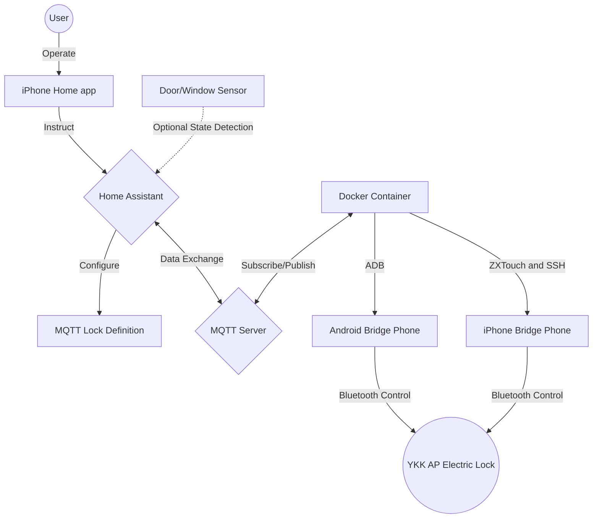

# YKK AP LOCK BRIDGE

This project connects a YKK AP electric lock to Home Assistant and HomeKit by using a phone as a bridge between the official YKK AP app and MQTT.

The Android version is the original implementation. The iPhone version was added later as an experimental branch of the same idea, but it is not especially stable yet and should be treated as a record of the implementation rather than a polished release.

## Table of Contents

- [Project Overview](#project-overview)
- [System Architecture](#system-architecture)
- [Versions](#versions)
- [Prerequisites](#prerequisites)
- [Installation and Configuration](#installation-and-configuration)
- [Usage](#usage)
- [iPhone Notes](#iphone-notes)
- [File Structure](#file-structure)
- [License](#license)

## Project Overview

The bridge subscribes to MQTT lock commands from Home Assistant, operates the YKK AP "スマートコントロールキー" app on a phone, reads the app state from screen pixels, and publishes the current lock state back to MQTT. Home Assistant can then expose the lock to Apple's Home app through the HomeKit integration.

## System Architecture



## Versions

- Android version: original implementation, controlled through ADB and Android screenshots.
- iPhone version: experimental implementation, controlled through ZXTouch and SSH on a jailbroken iPhone. This version is currently not very stable.

## Prerequisites

Common requirements:

- Home Assistant server with HomeKit integration
- MQTT server
- Docker environment for running the control script
- YKK AP "スマートコントロールキー" app paired with the door lock

Android bridge requirements:

- Android phone with the YKK AP app installed
- ADB access over USB or network

iPhone bridge requirements:

- Jailbroken iPhone with the YKK AP app installed
- SSH access to the iPhone
- ZXTouch installed and reachable from the Docker container
- Activator commands used by the script for wake/sleep and dim-mode handling

Related projects used by the iPhone version:

- [dounine/zxtouch](https://github.com/dounine/zxtouch)
- [KJCracks/Clutch](https://github.com/KJCracks/Clutch)

## Installation and Configuration

1. Clone this repository to your local machine or deployment host.
2. Put the bridge phone near the door lock and keep it powered on.
3. Choose the matching Docker Compose file:
   - Android: `docker-compose-android.yml`
   - iPhone experimental: `docker-compose-iphone.yml`
4. Update the environment values in the chosen Compose file:

   ```yaml
   environment:
     - TZ=Asia/Tokyo
     - MQTT_BROKER=YOUR_MQTT_BROKER
     - MQTT_PORT=21883
     - ADB_DEVICE=ANDROID_DEVICE_SERIAL_OR_HOST:PORT
   ```

   For the iPhone version:

   ```yaml
   environment:
     - TZ=Asia/Tokyo
     - MQTT_BROKER=YOUR_MQTT_BROKER
     - MQTT_PORT=21883
     - IPHONE_IP=YOUR_IPHONE_IP
     - ZXTOUCH_PORT=6000
     - IPHONE_SSH_PASSWORD=change-me
   ```

5. Update `configuration.yaml` in your Home Assistant setup:

   ```yaml
   input_boolean:
     fake_door_lock_status:
       name: "Virtual Door Lock Status"
       icon: mdi:lock

   lock:
     - platform: template
       name: "Home Door Lock"
       value_template: "{{ is_state('input_boolean.fake_door_lock_status', 'on') }}"
       lock:
         service: script.lock_door
       unlock:
         service: script.unlock_door
   ```

6. Update `automations.yaml` in your Home Assistant setup:

   ```yaml
   - id: update-door-lock-status
     alias: Update Door Lock Status
     trigger:
       - platform: mqtt
         topic: home/doorlock/state
     action:
       - choose:
           - conditions:
               - condition: template
                 value_template: "{{ trigger.payload == 'LOCKED' }}"
             sequence:
               - service: input_boolean.turn_on
                 target:
                   entity_id: input_boolean.fake_door_lock_status
           - conditions:
               - condition: template
                 value_template: "{{ trigger.payload == 'UNLOCKED' }}"
             sequence:
               - service: input_boolean.turn_off
                 target:
                   entity_id: input_boolean.fake_door_lock_status
   ```

7. Adjust the screen coordinates and color thresholds in the selected Python script for your actual phone and app layout.

## Usage

Start the Android bridge:

```bash
docker compose -f docker-compose-android.yml up -d
```

Start the experimental iPhone bridge:

```bash
docker compose -f docker-compose-iphone.yml up -d
```

The script subscribes to `home/doorlock/set`, accepts `LOCK` and `UNLOCK`, and publishes the detected state to `home/doorlock/state`.

## iPhone Notes

The iPhone implementation is kept here because it records the working approach and the exact software used during testing. It depends on a jailbroken iPhone, ZXTouch touch injection, SSH commands, and pixel color checks in the YKK AP app. In practice it still needs long-running stability testing and may require manual adjustment for screen state, sleep mode, app launch timing, and dim-mode behavior.

Reference screenshots are in `assets/iphone/screenshots/`. The software packages that were used during the iPhone experiment are archived under `assets/iphone/software/iPhone6s/`.

## File Structure

- `app_control_android.py`: Android bridge script using ADB
- `app_control_iphone.py`: experimental iPhone bridge script using ZXTouch and SSH
- `docker-compose-android.yml`: Docker configuration for the Android bridge
- `docker-compose-iphone.yml`: Docker configuration for the iPhone bridge
- `configuration.yaml`: Home Assistant configuration example
- `automations.yaml`: Home Assistant automation example
- `door-lock-state-flow.mermaid`: lock-state control flow diagram
- `system_overview_diagram.mermaid`: system overview diagram
- `assets/iphone/screenshots/`: iPhone app state screenshots
- `assets/iphone/software/iPhone6s/`: archived iPhone software packages used for this experiment
- `docs/iphone-development-notes.md`: development notes from the iPhone migration work
- `tools/test_zxtouch.py`: ZXTouch API test helper
- `screenshot_*.png`: Android app screenshots in different states

## License

This repository is a personal integration record. Check the licenses and redistribution terms of any third-party software before reusing or publishing it elsewhere.
